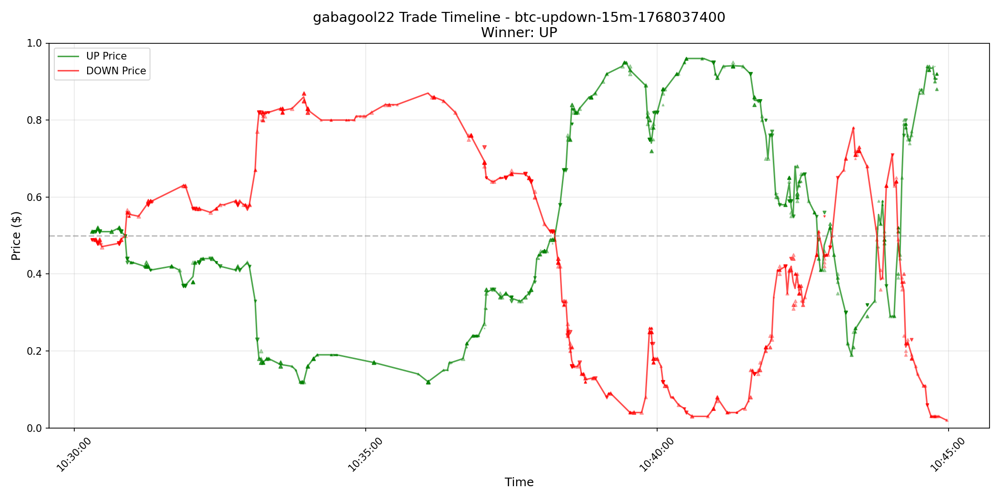
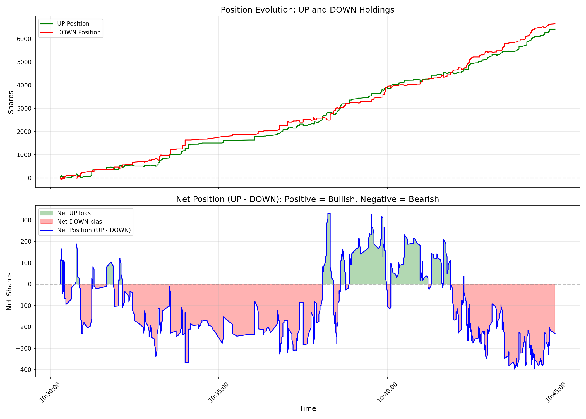
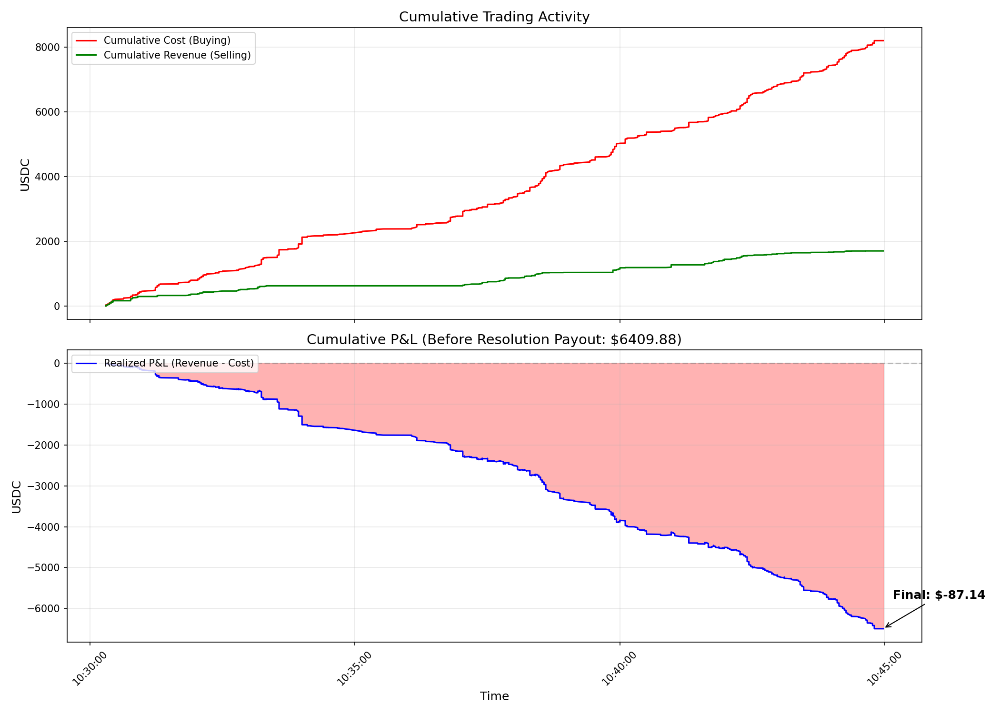
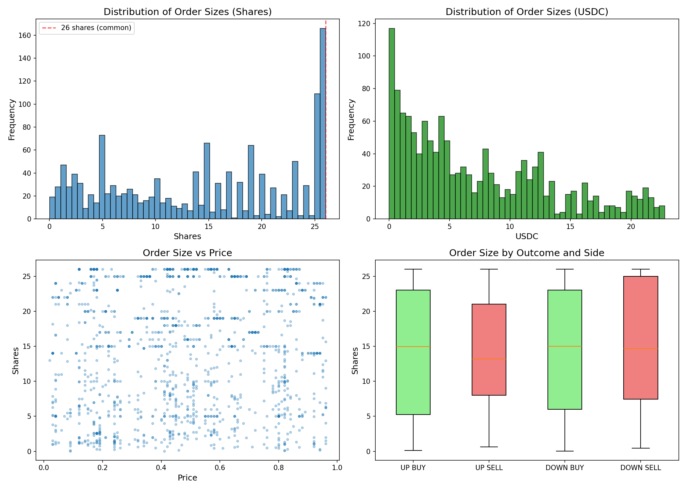

# Deep Strategy Analysis: gabagool22

## Executive Summary

**Wallet**: `0x6031b6eed1c97e853c6e0f03ad3ce3529351f96d`
**Market**: btc-updown-15m-1768037400
**Question**: Bitcoin Up or Down - January 10, 4:30AM-4:45AM ET
**Winner**: UP
**Total Trades**: 1377

### Key Finding: Why They Lost $87.14

gabagool22 operated as a **high-frequency market maker** with 79.6% maker trades. Despite massive trading volume (93.9 trades/minute), they **lost money** primarily because:

1. **Adverse Selection**: They accumulated 6640 DOWN shares (net) which became worthless when UP won
2. **Insufficient Edge**: Their combined buy prices averaged 98.60%, capturing only 1.4% edge - not enough to offset losses
3. **Wrong Direction at End**: They held significantly more DOWN than UP at resolution

---

## 1. Time-Series Analysis

### Price Behavior
- **Price Range**: 84.0%
- **Volatility (std)**: 25.6%
- **Price Points**: 263

The market was highly volatile, with UP price swinging from ~$0.51 at open to ~$0.12 mid-session, then recovering to ~$0.93 by close.

---

## 2. Position Evolution

### Final Positions
| Outcome | Position (shares) |
|---------|-------------------|
| UP | 6409.88 |
| DOWN | 6640.50 |
| **Net (UP - DOWN)** | **-230.62** |

### Position Metrics
- **Max UP Position**: 6409.88 shares
- **Max DOWN Position**: 6640.50 shares
- **Max Net Imbalance**: 396.83 shares
- **Balance Ratio**: 98.23% (1.0 = perfectly balanced)

**Interpretation**: They ended with ~231 more DOWN than UP shares. Since UP won, those DOWN shares became worthless.

---

## 3. P&L Breakdown

### Trading Summary
| Category | Amount |
|----------|--------|
| Total Cost (Buying) | $8197.88 |
| Total Revenue (Selling) | $1700.86 |
| Resolution Payout | $6409.88 |
| **Final P&L** | **$-87.14** |

### P&L by Outcome
| Outcome | P&L |
|---------|-----|
| UP trades | $3006.41 |
| DOWN trades | $-3093.55 |

### Cost/Revenue Breakdown
| | UP | DOWN |
|--|-----|------|
| Cost | $4405.16 | $3792.72 |
| Revenue | $1001.70 | $699.17 |

### Maker vs Taker
| Role | Cost | Revenue |
|------|------|---------|
| Maker | $7931.64 | $0.00 |
| Taker | $266.24 | $1700.86 |

---

## 4. Market Making Analysis

### Spread Capture
- **Combined Buy Price**: 0.9860 (UP + DOWN)
- **Edge Captured**: 1.40%
- **Spread Capture Events**: 62

### Adverse Selection Analysis
The key question: Did they get stuck holding the losing side?

| Side | Bought | Sold | Net |
|------|--------|------|-----|
| Winning (UP) | 8194.30 | 1784.42 | **6409.88** |
| Losing (DOWN) | 8196.55 | 1556.05 | **6640.50** |

**Verdict**: They accumulated 6640 shares of the **losing** outcome. This is classic adverse selection - market makers get picked off by informed traders.

### Role Breakdown
- **Maker trades**: 1096 (79.6%)
- **Taker trades**: 281 (20.4%)

---

## 5. Timing Analysis

### Trading Phases
| Phase | Trades | UP Net | DOWN Net | Bias |
|-------|--------|--------|----------|------|
| Early (first 5 min) | 397 | 1625.2 | 1778.7 | DOWN |
| Mid (5-10 min) | 449 | 2220.2 | 2182.5 | UP |
| Late (10-15 min) | 531 | 2564.5 | 2679.2 | DOWN |

### Timing Metrics
- **Duration**: 14.7 minutes
- **Trades per minute**: 93.9
- **Predicted winner correctly in early phase**: No

---

## 6. Order Size Analysis

### Size Statistics
| Metric | Shares | USDC |
|--------|--------|------|
| Mean | 14.33 | $7.19 |
| Median | 15.00 | - |
| Std Dev | 8.58 | - |
| Min | 0.03 | - |
| Max | 26.00 | - |

### Notable Pattern
- **26-share orders**: 163 (11.8% of all trades)

This suggests automated trading with fixed order sizes, typical of market-making bots.

---

## Strategy Classification

Based on the analysis, gabagool22 appears to be a **Delta-Neutral Market Maker**:

1. **High maker ratio (80%)** - Posts limit orders on both sides
2. **Balanced positions** - Tries to maintain equal UP and DOWN exposure
3. **Fixed order sizes** - Uses ~26 share blocks
4. **High frequency** - 94 trades/minute
5. **Captures spread** - Buys both outcomes below $1.00 combined

### Why the Strategy Failed This Time

1. **Market moved against them**: Price swung dramatically (UP crashed to $0.12, then recovered to $0.93)
2. **Inventory imbalance**: Ended with more DOWN than UP when UP won
3. **Insufficient edge**: Their ~1% spread capture wasn't enough to offset the directional loss
4. **Adverse selection**: Informed traders likely sold UP to them before the crash, then bought it back cheaper

---

## Conclusion

gabagool22 lost $87.14 because they ended up holding more of the losing outcome (DOWN) than the winner (UP). This is a classic market-making risk: when the market moves sharply in one direction, you get stuck holding the wrong side.

Their strategy works when:
- Markets are balanced (50/50 probability)
- Price doesn't move dramatically
- They can exit positions before resolution

It fails when:
- One outcome becomes heavily favored
- They can't unwind inventory fast enough
- Informed traders pick them off

**Final P&L: $-87.14**
